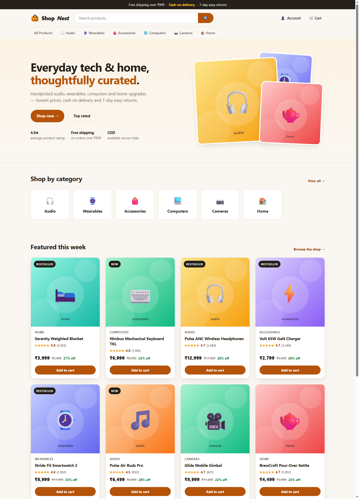

# ShopNest — a full-stack e-commerce website

A professional, production-styled online store built with **Express 5 + MongoDB (Mongoose)** on the backend and a **hand-crafted HTML/CSS/JS storefront** on the frontend — no frontend framework needed, no build step.



## Features

**Storefront**
- Home page with hero, category tiles and featured products
- Shop page with search (header), category tabs and price/rating sorting
- Product pages with gallery, stock status, quantity picker, feature list, related items
- Cart (persists in `localStorage`) with live totals and free-shipping progress (free over ₹999)
- Checkout with validated address form, **Cash on Delivery** or simulated **UPI**
- Order confirmation page with a status timeline; account page with sign-in / registration and order history
- Responsive layout, toast notifications, loading/empty states, generated SVG product art

**Backend (REST API)**
- Products: list / search / sort / detail / meta, plus admin create-update-delete
- Orders: server-side price calculation, stock + address validation, guest or signed-in checkout, order lookup, admin status updates
- Auth: register / login / logout / me with bcrypt password hashing and **httpOnly session cookies** (JWT)
- Security: security headers, JSON body limits, in-memory rate limiting on orders, admin gate, no secrets in code
- **Demo mode:** with no MongoDB configured the store runs on a 64-product sample catalog (11 categories, branded items) and simulated checkout, so `npm start` always works

## Quick start (demo mode — no database needed)

```bash
cd backend
npm install
npm start
# → ShopNest is ready at http://localhost:5000
```

Open http://localhost:5000 and shop. Demo orders are simulated (clearly labelled) and last 24 hours on the server.

## Going live with MongoDB

1. Copy the example env and edit it:
   ```bash
   cp backend/.env.example backend/.env
   ```
2. Set `MONGO_URL` (local `mongodb://localhost:27017/shopnest` or an Atlas URI) and generate a strong secret:
   ```bash
   node -e "console.log(require('crypto').randomBytes(48).toString('hex'))"   # → JWT_SECRET
   ```
3. Seed the catalog and start:
   ```bash
   npm run seed     # loads the 64 sample products into MongoDB
   npm start
   ```
4. Create your own admin by inserting a user with `role: 'admin'` (passwords are bcrypt hashes). Admin endpoints then allow product and order management.

The footer chip shows **“Live · MongoDB connected”** once the database is attached.

## Scripts

| Command (from repo root) | What it does |
|---|---|
| `npm start` | Start the server (`backend`) |
| `npm run dev` | Start with nodemon auto-reload |
| `npm test` | Run the test suite (17 tests — unit + full API integration, no DB needed) |
| `npm run seed` | Seed MongoDB with the sample catalog |

## API reference

| Method & path | Auth | Description |
|---|---|---|
| `GET /api/health` | – | Mode (`demo`/`mongodb`) + uptime info |
| `GET /api/products` | – | `?search= (name, brand, blurb) &category= &sort=featured\|priceAsc\|priceDesc\|rating\|discount &limit=` |
| `GET /api/products/meta` | – | Category list with counts |
| `GET /api/products/:slugOrId` | – | Product + related items |
| `POST /api/products` | admin | Create product (MongoDB mode) |
| `PUT/DELETE /api/products/:id` | admin | Update / delete product (MongoDB mode) |
| `POST /api/orders` | optional | Place order `{ items:[{slug,qty}], address:{...}, paymentMethod }` |
| `GET /api/orders/demo/:code` | – | Demo-order lookup (24 h) |
| `GET /api/orders/mine` | session | Order history |
| `GET /api/orders/:id` | optional | Guest orders by id; user orders need their session |
| `PATCH /api/orders/:id/status` | admin | `placed→processing→shipped→delivered/cancelled` |
| `POST /api/auth/register·login·logout`, `GET /api/auth/me` | –/session | Account management |

## Project structure

```
backend/
  index.js            # entry: env, DB (or demo mode), http server
  app.js              # express app: security, routes, static site, errors
  config/db.js        # mongoose connection
  controllers/        # auth, products, orders
  middleware/         # session auth (protect/optionalAuth), admin gate
  model/              # User, Product, Order, DemoOrder (in-memory)
  routes/             # authRoutes, productRoutes, orderRoutes
  utils/              # catalog (sample/DB switch), svg art, rate limit, email
  data/               # 64-product sample catalog (11 categories, brand field)
  scripts/seed.js     # seeds MongoDB
  test/               # node:test unit + API integration tests
frontend/             # served statically by express (7 pages, css, js)
```

## Notes & limitations

- UPI is **simulated**; wire Razorpay (already a dependency) server-side before accepting real payments. Email needs `EMAIL_USER`/`EMAIL_PASS` (Gmail app password) in `backend/.env`.
- `backend/utils/.env` in the original scaffold contained credential-looking values — **rotate any real credentials** and keep secrets only in `backend/.env` (git-ignored).
- Production: set `NODE_ENV=production` (secure cookies), serve behind HTTPS, and use a persistent session store if you scale horizontally.
